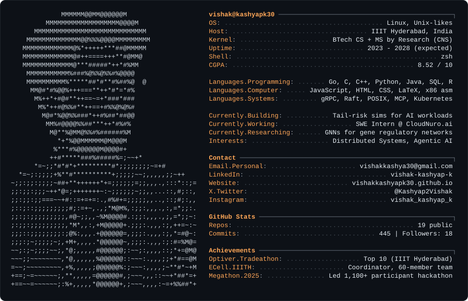

<picture>
  <source media="(prefers-color-scheme: dark)" srcset="dark_mode.svg" />
  <source media="(prefers-color-scheme: light)" srcset="light_mode.svg" />
  
</picture>

 

<a href="https://vishakkashyapk30.github.io/vishakkashyapk30/">Website</a>
&nbsp;·&nbsp;
<a href="https://www.linkedin.com/in/vishak-kashyap-k-0a0265217/">LinkedIn</a>
&nbsp;·&nbsp;
<a href="mailto:vishakkashya30@gmail.com">Email</a>
&nbsp;·&nbsp;
<a href="https://x.com/Kashyap2Vishak">X</a>

<!--
The card above is a hand-generated SVG: the portrait is my photo converted to
ASCII, and the panel is a neofetch-style summary. This repository also hosts
my personal website at vishakkashyapk30.github.io/vishakkashyapk30.
-->
